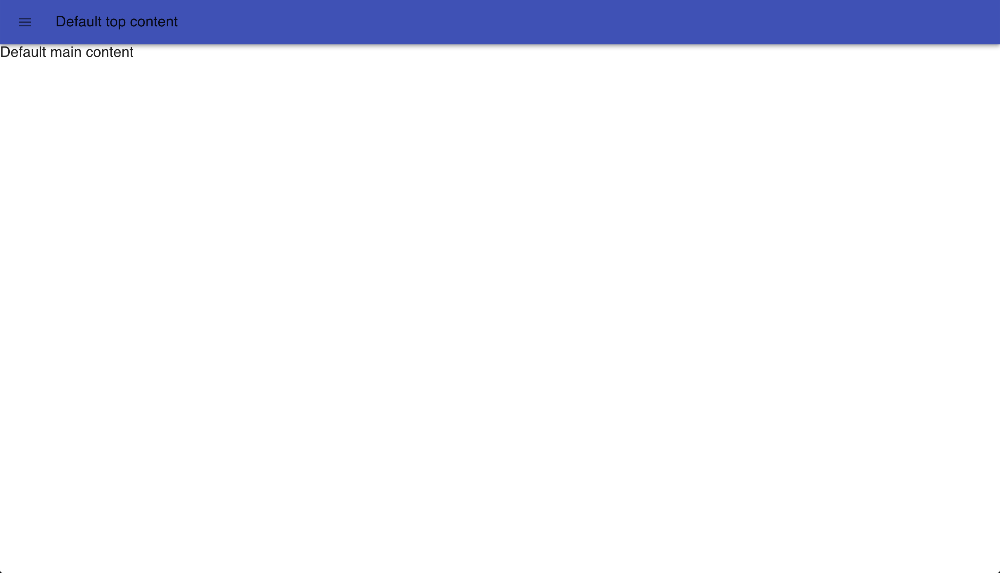
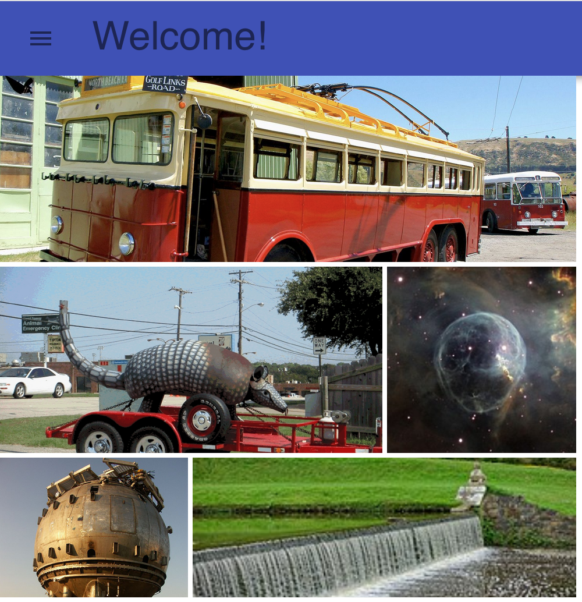
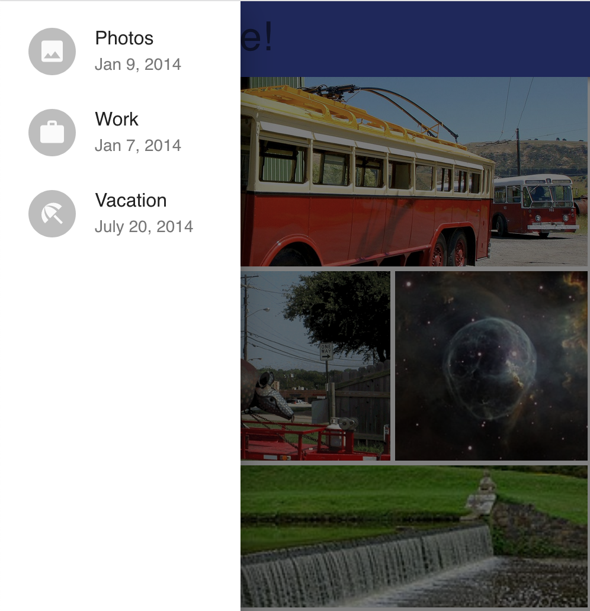

# Material App Layout
Providing a material layout for your react app in mere seconds.
Built- and matches well with [Material-UI](https://material-ui.com/)

## Hello Component!



```js 
class App extends Component {
  render() {
    return <Layout/>
  }
}
```
## Adding your own stuff 
Available props: 
1. top
2. menu
3. main

_That's it_. 

They may be filled with whatever you want!






```js 
import React, { Component } from 'react';

import Layout from 'material-app-layout'; 
import { Typography, List, ListItem, Avatar, ListItemText } from '@material-ui/core';
import GridList from '@material-ui/core/GridList';
import GridListTile from '@material-ui/core/GridListTile';

import ImageIcon from '@material-ui/icons/Image';
import WorkIcon from '@material-ui/icons/Work';
import BeachAccessIcon from '@material-ui/icons/BeachAccess';

import { withStyles } from '@material-ui/core/styles';

const styles = theme => ({
  root: {
    display: 'flex',
    flexWrap: 'wrap',
    justifyContent: 'space-around',
    overflow: 'hidden',
    backgroundColor: theme.palette.background.paper,
  },
  gridList: {
    width: 500,
    height: 450,
  },
  subheader: {
    width: '100%',
  },
});

const tileData = [
  {
    img: "https://upload.wikimedia.org/wikipedia/commons/thumb/c/c4/%21931_Factory_Built._English_Electric._%282%29_%288068911909%29.jpg/1599px-%21931_Factory_Built._English_Electric._%282%29_%288068911909%29.jpg", 
    cols: 3
  }, 
  {
    img: "https://upload.wikimedia.org/wikipedia/commons/c/c4/Bubba_N_Main.jpg", 
    cols: 2
  }, 
  {
    img: "https://upload.wikimedia.org/wikipedia/commons/thumb/d/d0/Bubble_Nebula_%2830847619376%29.jpg/240px-Bubble_Nebula_%2830847619376%29.jpg", 
    cols: 1
  }, 
  {
    img: "https://upload.wikimedia.org/wikipedia/commons/a/af/BubbleChamber-fnal_2.png", 
    cols: 1
  }, 
  {
    img: "https://upload.wikimedia.org/wikipedia/commons/thumb/3/36/Bubbles_-_Studley_Royal_Park_-_North_Yorkshire%2C_England_-_DSC00837.jpg/240px-Bubbles_-_Studley_Royal_Park_-_North_Yorkshire%2C_England_-_DSC00837.jpg", 
    cols: 2
  }
]
class App extends Component {
  render() {
    const { classes } = this.props;
    return <Layout 
      top={
        <Typography variant="display1">Welcome!</Typography>
      }
      menu={
        <List>
          <ListItem>
            <Avatar>
              <ImageIcon />
            </Avatar>
            <ListItemText primary="Photos" secondary="Jan 9, 2014" />
          </ListItem>
          <ListItem>
            <Avatar>
              <WorkIcon />
            </Avatar>
            <ListItemText primary="Work" secondary="Jan 7, 2014" />
          </ListItem>
          <ListItem>
            <Avatar>
              <BeachAccessIcon />
            </Avatar>
            <ListItemText primary="Vacation" secondary="July 20, 2014" />
          </ListItem>
        </List>
      }
      main={
        <GridList cellHeight={160} className={classes.gridList} cols={3}>
          {tileData.map(tile => (
            <GridListTile key={tile.img} cols={tile.cols || 1}>
              
            </GridListTile>
          ))}
        </GridList>
      }
    />
  }
}

export default withStyles(styles)(App);
```